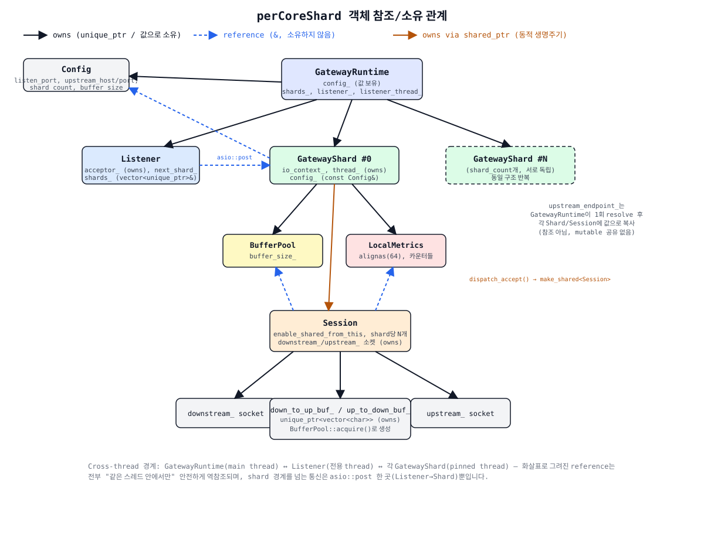

# 객체 소유/참조 관계 (Ownership & Reference Diagram)

현재 `src/` 구현에서 각 객체가 다른 객체를 **소유(owns)**하는지, **참조(reference)**만 들고 있는지, 아니면 **shared_ptr로 동적 소유**하는지를 정리한 다이어그램입니다.

## 텍스트 요약

| 보유 객체 | 대상 | 관계 | 의미 |
|---|---|---|---|
| `GatewayRuntime` | `Config config_` | 값으로 소유 | 시작 시 `Config::from_args`로 만든 값을 그대로 보관 |
| `GatewayRuntime` | `vector<unique_ptr<GatewayShard>> shards_` | 소유 (unique_ptr) | shard의 생명주기를 runtime이 책임짐 |
| `GatewayRuntime` | `unique_ptr<Listener> listener_` | 소유 (unique_ptr) | listener 생명주기도 runtime이 책임짐 |
| `Listener` | `vector<unique_ptr<GatewayShard>>& shards_` | **참조** | shard를 소유하지 않고, round-robin 대상만 가리킴 |
| `GatewayShard` | `const Config& config_` | **참조** | `GatewayRuntime`이 소유한 `Config`를 읽기 전용으로 참조 |
| `GatewayShard` | `boost::asio::ip::tcp::endpoint upstream_endpoint_` | 값으로 소유(복사) | `GatewayRuntime::start()`에서 1회 resolve한 결과를 각 shard가 **복사**해서 들고 있음 (mutable 공유 없음) |
| `GatewayShard` | `BufferPool buffer_pool_`, `LocalMetrics metrics_` | 값으로 소유 | shard-local 리소스, 다른 shard와 공유하지 않음 |
| `GatewayShard` | `Session` (동적 생성) | **shared_ptr로 소유** (via `dispatch_accept` → `make_shared<Session>`) | Session은 pending async 작업 체인이 `shared_from_this()`로 자기 자신을 붙잡고 있는 동안 살아있음 — 소유자는 사실상 "실행 중인 async 콜백들" |
| `Session` | `BufferPool& buffer_pool_`, `LocalMetrics& metrics_` | **참조** | 자신을 만든 shard의 리소스를 참조만 함, 소유하지 않음 |
| `Session` | `tcp::socket downstream_`, `tcp::socket upstream_` | 소유 | 이 connection에 대한 두 소켓을 직접 소유 |
| `Session` | `unique_ptr<vector<char>> down_to_up_buf_`, `up_to_down_buf_` | 소유 (unique_ptr) | `BufferPool::acquire()`로 만들어 Session이 소유, `close()`/소멸 시 해제 |

## 핵심 규칙

- **참조(파란 점선)는 전부 "소유 객체와 같은 스레드"에서만 역참조됩니다.** 예: `Session`이 들고 있는 `LocalMetrics&`는 그 Session을 만든 `GatewayShard`의 멤버이고, Session의 모든 콜백은 그 shard의 `io_context`(= 그 shard의 pinned thread)에서만 실행되므로 안전합니다.
- **shard 간 경계를 넘는 유일한 지점은 `Listener → GatewayShard::dispatch_accept`** 하나뿐이며, 반드시 `asio::post(shard.io_context(), ...)`를 통해서만 넘어갑니다. 그 외에는 어떤 객체도 다른 shard의 객체를 직접 참조하지 않습니다.
- `Config`와 `upstream_endpoint_`처럼 여러 shard가 같은 값을 알아야 하는 경우, **참조 공유가 아니라 각자 복사본을 들고 있는 방식**으로 shared-nothing 원칙을 지킵니다.
